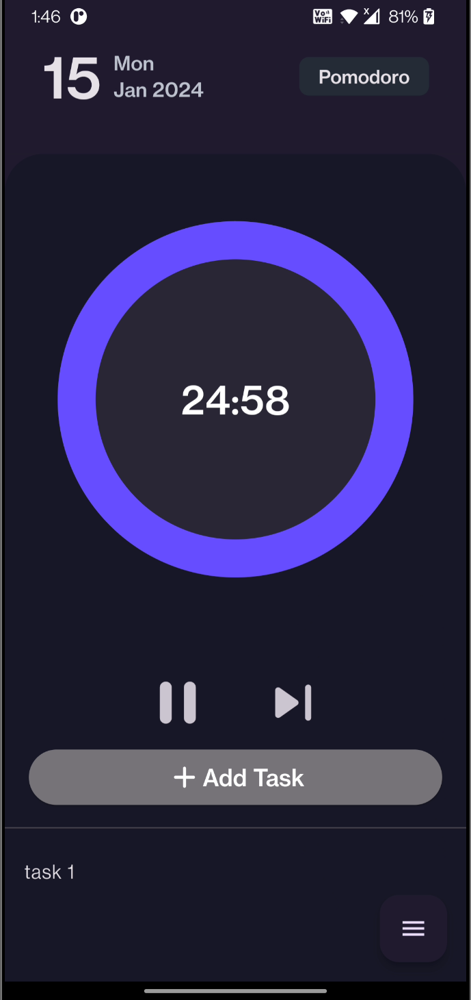

# PMDR 

PMDR is a Pomodoro timer app currently in development. The project utilizes the Bloc state management pattern and employs Objectbox for local storage.

## Features

- 3 sections: Pomodoro(25 mins), Short Timer(5 mins), Long Timer(15 mins)

- Vibration when timer ends.

- Automatic navigation to Short Timer section when Pomodoro Timer ends.

- Tapping on a task deletes it.

- Local storage of tasks (uses Objectbox database)

## Screenshots

## Installation

To get started with this project, follow these steps:

- Clone the project to your local machine.
- Open the project in your preferred IDE or text editor.
- Run flutter pub get to install the required dependencies.

## Contributing

We welcome contributions to PMDR. Feature suggestions and implementations are welcome. If you would like to contribute to the development or report issues, please follow these guidelines:

1. Fork the repository.

2. Create a new branch for your feature or bug fix.

3. Make your changes and commit them with descriptive messages.

4. Push your changes to your fork.

5. Submit a pull request to the main repository.

## License

ProjectName is licensed under the [MIT License](LICENSE).

Thank you for choosing ProjectName! If you encounter any issues or have suggestions for improvements, please don't hesitate to [create an issue](https://github.com/aricodeine/pmdr/issues) or [contribute to the project](#contributing). We look forward to your feedback and collaboration.